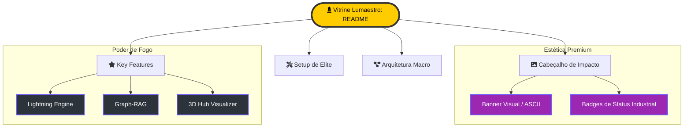

# 🎨 Estratégia de Vitrine Técnica (README)

> [!ABSTRACT]
> O objetivo desta estratégia é transformar o `README.md` principal em uma vitrine tecnológica de elite. Ele deve refletir o poder do Lumaestro como um motor cognitivo soberano, atraindo tanto o Comandante (usuário final) quanto o Arquiteto (desenvolvedor).

## 🏗️ Estrutura da Vitrine de Impacto

Abaixo, os componentes fundamentais que compõem a nova face do projeto.

---

## 💎 Componentes Propostos

### 1. Cabeçalho de Elite
- **Impacto**: Banner em ASCII Art ou Logotipo de alta fidelidade.
- **Identidade**: Subtítulo que define o Lumaestro: "The Sovereign Cognitive Engine for Knowledge Architects."

### 2. Destaques de Poder (Key Features)
- **⚡ Lightning Engine**: Análise reflexiva via DuckDB e telemetria de tokens.
- **🧠 Graph-RAG**: Integração profunda com Obsidian e busca vetorial baseada em sentido.
- **🪐 3D Hub**: Navegação orbital com algoritmos de PageRank e detecção de comunidades.

### 3. Setup Simplificado
- **Scripts de Poder**: Instruções claras para `./dev` e `./build`.
- **Portabilidade**: Destaque para o executável nativo único (Single Binary).

---

## 🧭 Questões Abertas para o Comandante

1.  **Identidade Visual**: Existe algum logotipo específico ou paleta de cores (além do roxo/neon atual) para o banner?
2.  **Roadmap Público**: Devemos incluir a seção de funcionalidades futuras (como suporte a MCP e modo offline total) para gerar expectativa?

---

## 🔗 Documentos Relacionados

- [[DOCS_INDEX]] — O mapa completo para quem quer mergulhar fundo.
- [[SINFONIA]] — A história da evolução do projeto.
- [[GAP_ANALYSIS]] — Transparência sobre o estado atual de desenvolvimento.

---
**Lumaestro: Sua vitrine. Sua inteligência. Sua soberania. 🎨💎🚀**
